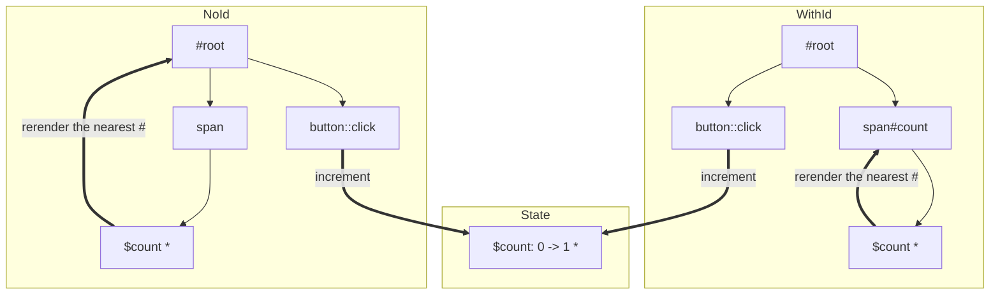

# Purity. Declarative State & DOM Manager


Declarative UI library for using the most of today's Javascript.
It doesn't require any bundlers or using npm at all, it fully leverages the native ECMAScript modules system.

**Purity** exposes two main instruments to manipulate an application:

- `init` which initializes the app with a default state (application-wide)

- `render` tag that wraps string templates that represent app components

## Usage

### Basic Syntax

To use **Purity** in a project you have to put in your **index.html** a root element where your app will be mounted into, and script tag of `[type=module]` which points to the main js file:

```html
<html>
  <body>
    <div id="root"></div>
    <script type="module" src="./main.js">
  </body>
</html>
```

Import **Purity** from a local file or a public URL, e. g.:

```js
import {init, render} from 'https://tatomyr.github.io/purity/purity.js'
```

Next, you init the app with some default state. This will return a bunch of methods you can use in your app:

```js
const {mount, getState, setState} = init(defaultState)
```

Then you declare a component using the `render` tag:

```js
const App = () => render`
  <div id="root">Hello Purity!</div>
`
```

Make sure, your root element has the same `id` attribute as the root defined in **index.html**.

Finally, you have to mount the App to DOM:

```js
mount(App)
```

That's it, the simplest possible Purity application is ready to be deployed!

### Nested Components

Since our components are merely bare functions that return a string, we can embed other functions called with some arguments, that return a string:

```js
const Child = ({name}) => render`
  <div>Hello ${name}!</div>
`

const Parent = () => render`
  <div>
    <h1>Welcome page</h1>
    ${Child({name: 'Guest'})}
  </div>
`
```

### Event Binding

We can add some interactivity by binding events:

```js
const Clickable = () => render`
  <button ::click=${() => alert('Hello!')}>
    Click Me
  </button>
`
```

Please notice the double-colon syntax. The pattern is `::event-name=${<event-handler>}`.

**Purity** binds events to DOM asynchronously, so be careful when writing tests.
You have to use `await delay(0)` before you can simulate an event after DOM gets updated.

There is also another substantial limitation to using event handlers.
Do consider each handler an isolated function that can receive nothing from the upper scopes.
For instance, the example below is wrong since we are trying to use `WRONG_COUNT`, which has been calculated in the component's scope, inside the click handler:

```js
const WrongCounter = () => {
  const WRONG_COUNT = getState().count

  return render`
    <div id="root">
      <pre id="count">Wrong: ${WRONG_COUNT}</pre>
      <button 
        ::click=${() => setState(() => ({count: WRONG_COUNT + 1}))}
      >
        Increment
      </button>
    </div>
  `
}
```

Although the increment on click _will_ work once, it is not guaranteed to do so every time.
The event binds on the first execution, but the _button_ doesn't get updated further, so both the event handler and its _closure_ remain the same.

The correct example would look like this:

```js
const CorrectCounter = () => render`
  <div id="root">
    <pre id="counter">Counter: ${getState().count}</pre>
    <button ::click=${() => setState(({count}) => ({count: count + 1}))}>
      Increment
    </button>
  </div>
`
```

Please notice that `setState`'s callback receives current state as the argument.

### Virtual DOM

Bear in mind that each changeable node should have a unique id attribute defined on it.
This allows the DOM re-renderer to decouple changed nodes and update only them.
It has nothing to do with **components** which are just functions to calculate the HTML.

You can think of your application as a tree where each tag with the `id` attribute is represented by a **virtual node**.
The most important part of the virtual DOM is the **rerenderer**.
It calculates new virtual DOM and traverses through each existing **virtual node**.
If a new corresponding **virtual node** exists, and it shallowly differs from the previous one, the **rerenderer** replaces `innerHTML` of the **node** and attributes of a wrapper tag.

This way **rerenderer** could preserve text inputs cursor position, scrolling progress, &c.
At the same time, it allows a programmer to fully control the updating process.

DOM nodes get re-rendered depending on how `id`s are placed across them.
Basically, Purity will rerender everything inside the closest common ancestor with an `id` defined on it.

To get a better understanding, let's compare two applications that differ only by one `id` attribute.

```js
const NoId = () => render`
  <div id="root">
    <span>${getState().count}</span>
    <button 
      ::click=${({count}) => setState({count: count + 1})}
    >
      Update
    </button>
  </div>
`

const WithId = () => render`
  <div id="root">
    <span id="count">${getState().count}</span>
    <button 
      ::click=${({count}) => setState({count: count + 1})}
    >
      Update
    </button>
  </div>
`
```

You can see the difference in the graph below:



In the _NoId_ example, after updating the state inside the span all the app gets re-rendered since the closest node with `id` is _root_.
As a consequence, _button_ loses focus.
On the other hand, in the _WithId_ example the only thing going to be re-rendered is text inside _span#count_.

### Async Flow

[In progress...](https://tatomyr.github.io/purity/playground/#JYWwDg9gTgLgBAb2AO2DANHKBTZATbKAXzgDMoIQ4ByAOloHoUCAPWgKwGdqAoHgYwjJO8BCAgBXZBjgBzbDADKMAIYxsmTguVqNWQrgLE4AXjgo0ACgQ84duCJVRZKgF6FOAfUFSYALhoAWmpMW3sfaQCABnQwuxxITgCAbQBdWPsHbAAbbH51PAAlbEgAqQJSFGw8DPtOMBRkQgDSFWytWKIASj4GBjgAKiHhkdGx8YnJqemxvkFheBAVAGtsAHlkfmxTOEsu0wA+RDi4eZFTtvadhCI+TJwYCShkXeAauABHCUIAT32TI42TKZYCkXYAQn4l04yTeqX2QOBSKh2XasLwqR2MCg3xOSLsX1+ezx9lumVutwEQnOQi2OyWqw2W2JPD6gxmHM5XO5Azm1PgazAMGAQh21mQKhAejwwE4KgARrk8N1Dvp8IQAAYnAA8ECFIpeADc2t8TAAiAAkCAlUqIZrgVpt2xMLrk2lU6j2tC0uXy1WKkDgADIgzQfXkCtQSFaZXLFdVg6HqLGFUqowcSXZHZLsGT7NqGHrhUIM1qqQtTgALPLLYr1anO-ScVWIuygiE4Ti0CDLBGZuC5eCEKA7JoAdzgAFEoBQoJYzQAJAAqS4ACg4PRJm4ICAF7QBqJvezecHr4uDD2idyDCRud-uXxyPZtmTvHtRb-swSsUCfDk55vEChPC8b5cEIxKUmc8DyEoqhQC++iQAAcjmqqkAo-CVpYGqVjAMBgEkfQqA0tCyGglYSPKtCCCADAJBAnAMB6lA-FADBWgxqG2hqZ72LQ364JYWE1nWN5aHxdgCdWyCWNYjjOG4HjeJI0gqgCWRwbocn-Ec8nwS47gISpvjdF0klwDRahYTpqpaFpnp7Kq+lOIZykRP4QRRuZFm0JUEqoj8tkafZOiObpuwIPUjTNGQbRaGZPTlucDGcAAqlA2Q7Lh+GEX4xGkeR35UTRlAMFuHjMWorHsalAD8nDQDAJgSGAeC6HgQZgIQnhgCo8gmAAjFEURltBcCKDkEZihFrZwLS2CWKlGXZJgTkaRhMA2ctmUWZk0lCSJ-C1tg9a3nt-FQlt2GWMOEVtIQMC3TOtBSpwcryOZ-YHbJqUtv2mTjeGfpFCUEA7PVtDJFEqR1bQToA3U7raetekIKlmgNMgTRQAE2LfJoU0gwGEBmYjQGPM8WS+gUJP9t032CbJsE6AhFlJfcwFUzg6pQFq57asD8Dk3Afh+FhKjIANVrWAZCgBAgxrZN8ARC-6YNEOpgIi5koUeotqORWroOQJjMW43A+O5l957niz8GcJYxskxdSKa-2Rwi1a9vaV0V5g5wcNLGAliCsWyBdIBwIFkLGaZFqUH8nAACCYBgDN-0nA8IFqkY-P4tqMqGuYeDmhQEAwGace21mCCTTTeyUjXdjamAOAl+aCmcFXOv2N7yOen70XY4QcB1TQgDYxNQos0IACtSAPB-UYOggPuD++ilGV4HkkKznAiwWbfYNXNf7z+cAMBm+-yhI+Gir3dhi-w2TAMdJgyxFesowg28RdYHkBB5OAh5BpmSjueY+zc7AAGFn7HX3gwa+t9kAQIFofA4gA+DcAHe7y9V6LT9tvOAMCX7LE4AfHAl8BYMCLhAhOfBxC+EsKnMAPQgA)

<!-- TODO: -->

### Tips

- Use uncontrolled text inputs and put them wisely, so they won't be re-rendered when the input value has been changed.
  Form elements like checkboxes and selects could be used either in a controlled or uncontrolled way.
- Wrap every component that you want to be rerendered independently with a tag with a unique id.
- Do not relay on any constants declared in a component's scope inside event handlers.
  Each event handler should be considered completely isolated from the upper scope.
  The reason is that the Virtual DOM doesn't take into account any changes in event handlers.
  Albeit you do may use a data-specific `id` on the tag to change this, it is not recommended due to performance reasons.
  See the [example](https://tatomyr.github.io/purity/playground/#JYWwDg9gTgLgBAb2AO2DANHKBTZATbKAXzgDMoIQ4ByAOloHoUCAPWgKwGdqAoHgYwjJO8BCAgBXZBjgBzbDADKMAIYxsmTguVrsJALxwUaABQIA7hWSyAXHAAMmQVBz8Yd+0QCUfQcPgAgmBgcIYmXqEAfIg8cHB+InAA6gBKAPIAcgDioXLaqurhtJZCsrHxQokAwmkpKQCiVQAqufJKBdhFzq4wfHE4MBJQyFi4BFAABuVxADx4wABuRnj6AEQUEDCrkdNxcDNgOMtrJdbbSVa2cAAkCKmZWUQzDIfYO3t7MwBGEjAwQnBdh8bDZ+AAbYD8ADW+lu4SicC07V0Jnh+miZlOV3u2TgAGo4ABGbxeIhAuDvD57ACSyH4OBAuF6VP2DB+fyElI+MwAFlA4AwuZ9XsdVt1sG5tlVoD07LcanVGk0ni8cELZuz-iNyXEQeDITC4RF0Yj8iizOK3N4ERaZRL3BUXPb8USSWSWeqaXSGUzyc9NZzds95gtKVMyTxxFIYCYgmAfEA) for more context.
  
- Root component must have the same id as the HTML element you want to mount the component to.
  (Depends on the algorithm we're using for mounting.)
- A **component**'s local state management is considered a secondary feature.
  Therefore it's not a part of the library. However, it could possibly be implemented using **rerender** method which is returned from the **init** function (see [example](./src/examples/use-state-example/StatefulCounter.js)).
- The library doesn't sanitize your inputs.
  Please do it by yourself or use the `sanitize.js` module.
- Due to its asynchronous nature, Purity requires special testing for applications that use it.
  Make sure you make delay(0) after the DOM has changed (see examples in [purity.test.ts](./src/purity.test.ts)).

## Credits

This library is heavily inspired by project [innerself](https://github.com/stasm/innerself).
And obviously, I was thinking of [React](https://github.com/facebook/react/).

The decision to use bare ES modules appears to be the consequence of listening to the brilliant Ryan Dahl's talk on [Deno](https://deno.land).

## Examples of usage

- [Dead simple example](./src/examples/dead-simple-example)
- [Simple todo](./src/examples/simple-todo-example)
- [Asynchronous todo](./src/examples/async-todo-example)
- [Colored input](./src/examples/colored-input-example)
- [Stateful counters](./src/examples/use-state-example)
- [ToDo application](https://github.com/tatomyr/reactive-todo)
- [Async search](./src/examples/async-search)
- [Multiple Applications in the same page](./src/examples/multiple-apps)

Please find the examples [here](https://tatomyr.github.io/purity/examples/)

You can access them locally using `bash bin/serve.sh` and opening `http://localhost:8081/public/examples/`.

## Playground

Feel free to experiment in the [Playground](https://tatomyr.github.io/purity/playground/).

## Miscellaneous

The library also includes a handful of algorithms from different sources, exported as ES modules to use with **Purity** or without.

The most important ones are `router` and `async` which could help with navigation and performing asynchronous operations respectively.
